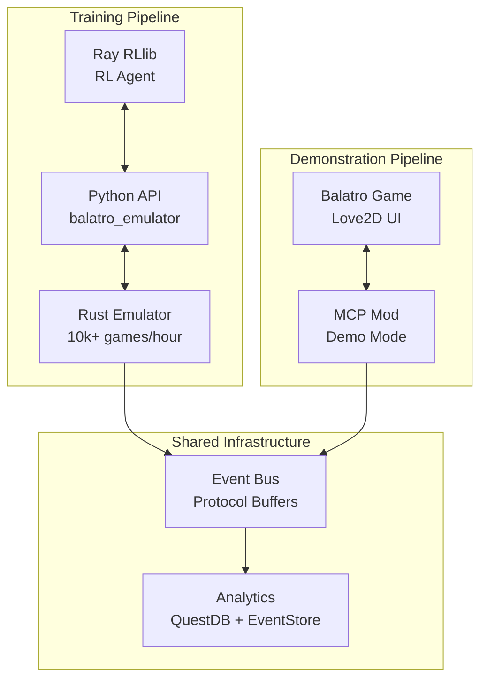

# Balatro Rust Emulator Architecture Summary

## Quick Overview

The new architecture replaces the MCP mod's headless mode with a high-performance Rust emulator while keeping the MCP mod for demonstrations.

## Key Changes

### Before (Current State)
- **MCP Mod** handles both headless execution and demonstrations
- **Performance**: Limited by Lua/Love2D overhead (4x speed max)
- **Integration**: Direct HTTP communication with Event Bus

### After (New Architecture)
- **Rust Emulator** handles all headless/training execution
- **MCP Mod** retained for UI demonstrations only
- **Performance**: 10-100x faster execution
- **Integration**: gRPC for training, Event Bus for monitoring

## System Overview



## Implementation Phases

### Phase 1: Rust Emulator Development (4 weeks)
1. **Week 1**: Core game engine and card mechanics
2. **Week 2**: Action processing and scoring
3. **Week 3**: Joker system and shop
4. **Week 4**: API and Python integration

### Phase 2: Integration (1 week)
- Update MCP mod configuration
- Integrate with Ray RLlib
- Validation testing

### Phase 3: Migration (1 week)
- Switch training to Rust emulator
- Update documentation
- Performance optimization

## Key Benefits

1. **Performance**
   - From ~1,000 games/hour to 10,000+ games/hour
   - Sub-10ms action execution
   - Parallel game execution support

2. **Maintainability**
   - Clean separation of concerns
   - Type-safe Rust implementation
   - Comprehensive test coverage

3. **Scalability**
   - Distributed training support
   - Efficient resource utilization
   - Production-ready architecture

## Quick Start (After Implementation)

```python
# For RL Training
from balatro_emulator import BalatroEnv

env = BalatroEnv(deck="Red", stake="Gold", seed=12345)
obs = env.reset()
action = env.action_space.sample()
obs, reward, done, info = env.step(action)
```

```bash
# For Demonstrations
# config.json: {"mode": "demo", "event_bus_url": "http://localhost:8080"}
# Run Balatro with MCP mod as usual
```

## Next Steps

1. Review the full specification: `balatro_rust_emulator_spec.md`
2. Review integration plan: `mcp_rust_integration_plan.md`
3. Approve architecture or request modifications
4. Begin Sprint 1 implementation

Ready for `/bugify` to create implementation issues!