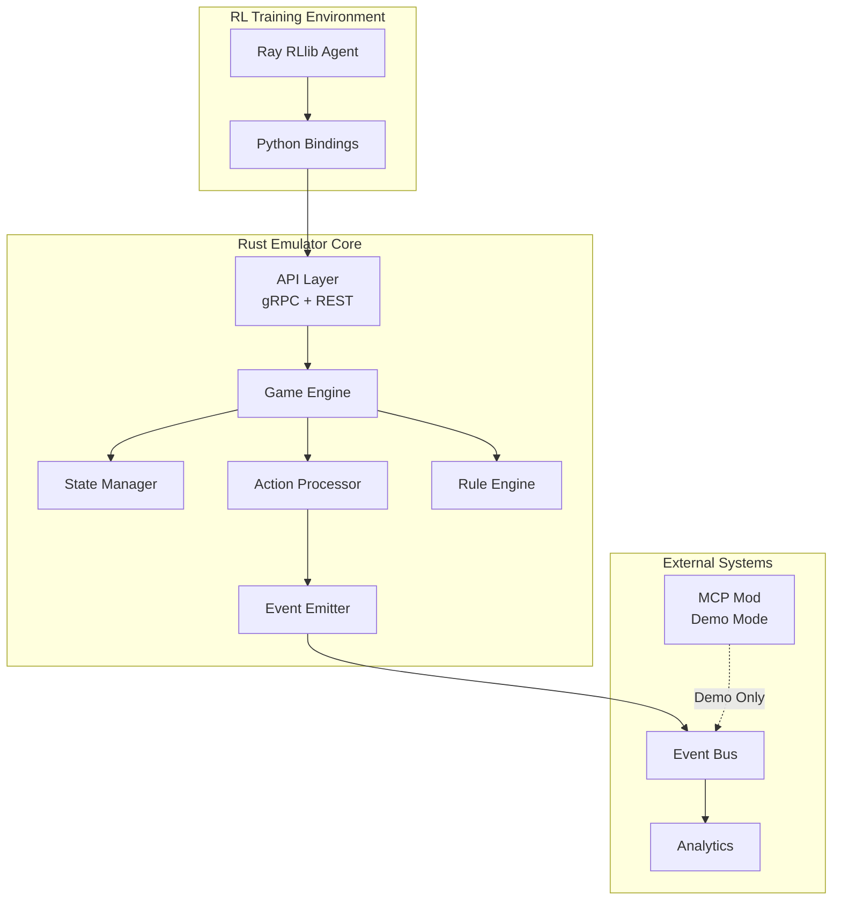
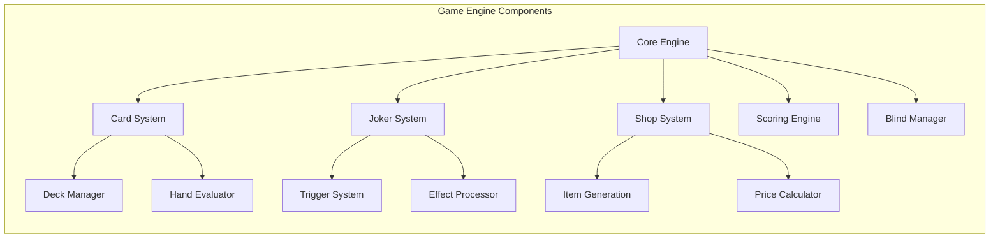
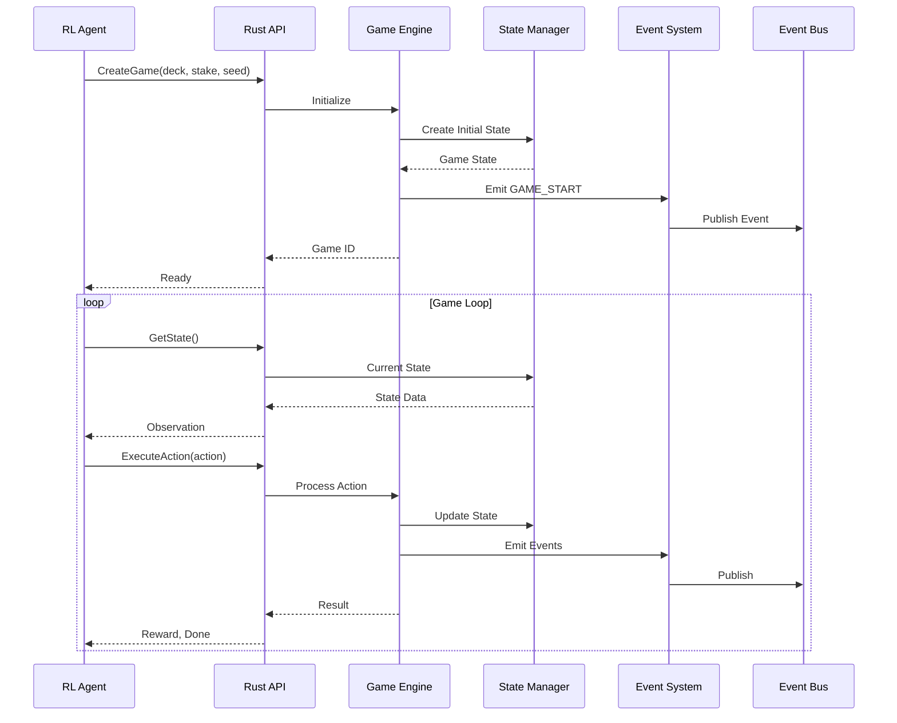

# Balatro Rust Emulator Technical Specification

## Executive Summary

This specification outlines the design and implementation of a headless Rust-based Balatro emulator to replace the current Lua mod's headless mode. The emulator will enable reinforcement learning at faster-than-realtime speeds while maintaining complete game fidelity. The MCP mod will retain its interaction features for demonstration purposes but delegate headless execution to the Rust emulator.

### Key Objectives
- **Performance**: Execute games 10-100x faster than real-time
- **Fidelity**: Exact replication of Balatro game mechanics  
- **Integration**: Seamless compatibility with existing JimBot infrastructure
- **Scalability**: Support parallel game execution for distributed RL training

## Requirements Analysis

### Functional Requirements

#### Core Game Mechanics
1. **Complete Game State Management**
   - Deck initialization with 52 playing cards
   - Joker slots (5 default, expandable)
   - Consumable slots (2 default)
   - Shop inventory generation
   - Blind progression system

2. **Game Configuration**
   - Support all starting decks (Red, Blue, Yellow, Green, Black, Magic, Nebula, Ghost, Abandoned, Checkered, Zodiac, Painted, Anaglyph, Plasma, Erratic)
   - Support all stake levels (White through Gold)
   - Seed-based deterministic gameplay
   - Challenge run configurations

3. **Action Execution**
   - Playing phase: card selection, hand playing, discarding
   - Shop phase: buying/selling jokers, boosters, vouchers, rerolling
   - Blind selection: small, big, boss, skip
   - Consumable usage: tarot, planet, spectral cards

4. **Scoring System**
   - Base chip and mult calculation
   - Hand type detection (High Card through Straight Flush)
   - Joker trigger evaluation in correct order
   - Multiplicative effects and scoring combos
   - Boss blind effects

5. **Event Emission**
   - Compatible with existing Protocol Buffer schemas
   - Maintain event aggregation patterns
   - Support both polling and streaming interfaces

### Non-Functional Requirements

1. **Performance**
   - Single game execution: <10ms per action
   - Throughput: >10,000 games/hour on single CPU core
   - Memory usage: <100MB per game instance
   - Startup time: <50ms

2. **Reliability**
   - Deterministic execution with same seed
   - No memory leaks during long training runs
   - Graceful error handling and recovery
   - State serialization/deserialization

3. **Integration**
   - gRPC API for RL agent communication
   - REST API for debugging and monitoring
   - Event Bus compatibility (Protocol Buffers)
   - Python bindings for Ray RLlib integration

4. **Observability**
   - Detailed logging with configurable levels
   - Performance metrics collection
   - Game replay from event logs
   - State inspection tools

## Architecture Overview

### System Architecture



### Component Architecture



### Data Flow



## Technical Architecture

### Technology Stack

- **Language**: Rust (2021 edition)
- **Async Runtime**: Tokio
- **Serialization**: Protocol Buffers (prost), Serde
- **API Framework**: Tonic (gRPC), Axum (REST)  
- **Python Bindings**: PyO3
- **Testing**: Rust native tests, property-based testing with proptest
- **Benchmarking**: Criterion.rs

### Core Data Structures

```rust
// Core game state
pub struct GameState {
    pub game_id: String,
    pub seed: u64,
    pub ante: u8,
    pub round: u8,
    pub phase: GamePhase,
    pub resources: Resources,
    pub deck: Deck,
    pub jokers: Vec<Joker>,
    pub consumables: Vec<Consumable>,
    pub shop: Shop,
    pub blind: Option<Blind>,
    pub score_history: Vec<RoundScore>,
}

pub struct Resources {
    pub money: i32,
    pub hands: u8,
    pub discards: u8,
    pub hand_size: u8,
    pub joker_slots: u8,
    pub consumable_slots: u8,
}

pub struct Card {
    pub id: Uuid,
    pub rank: Rank,
    pub suit: Suit,
    pub enhancement: Option<Enhancement>,
    pub edition: Option<Edition>,
    pub seal: Option<Seal>,
}

pub struct Joker {
    pub id: Uuid,
    pub joker_type: JokerType,
    pub edition: Option<Edition>,
    pub triggers: Vec<TriggerCondition>,
    pub effects: Vec<Effect>,
    pub state: JokerState, // For jokers with internal state
}
```

### API Specification

#### gRPC Service Definition

```proto
service BalatroEmulator {
    // Game lifecycle
    rpc CreateGame(CreateGameRequest) returns (CreateGameResponse);
    rpc GetState(GetStateRequest) returns (GameStateResponse);
    rpc ExecuteAction(ActionRequest) returns (ActionResponse);
    rpc ResetGame(ResetRequest) returns (ResetResponse);
    
    // Bulk operations for training
    rpc CreateGames(CreateGamesRequest) returns (stream CreateGameResponse);
    rpc ExecuteActions(stream ActionRequest) returns (stream ActionResponse);
    
    // Debugging
    rpc GetGameHistory(GameHistoryRequest) returns (GameHistoryResponse);
    rpc ValidateState(ValidateStateRequest) returns (ValidateStateResponse);
}
```

#### REST API Endpoints

```
POST   /api/v1/games                 # Create new game
GET    /api/v1/games/{id}/state      # Get current state
POST   /api/v1/games/{id}/action     # Execute action
DELETE /api/v1/games/{id}            # Destroy game

# Bulk operations
POST   /api/v1/games/bulk            # Create multiple games
POST   /api/v1/actions/bulk          # Execute multiple actions

# Debugging
GET    /api/v1/games/{id}/history    # Get game history
GET    /api/v1/games/{id}/validate   # Validate game state
```

### Module Structure

```
balatro-emulator/
├── Cargo.toml
├── src/
│   ├── main.rs              # Entry point
│   ├── lib.rs               # Library interface
│   ├── api/
│   │   ├── grpc.rs          # gRPC service implementation
│   │   └── rest.rs          # REST API implementation
│   ├── engine/
│   │   ├── mod.rs           # Game engine core
│   │   ├── state.rs         # State management
│   │   └── actions.rs       # Action processing
│   ├── game/
│   │   ├── cards.rs         # Card system
│   │   ├── jokers.rs        # Joker system
│   │   ├── shop.rs          # Shop mechanics
│   │   ├── scoring.rs       # Scoring engine
│   │   └── blinds.rs        # Blind management
│   ├── events/
│   │   ├── emitter.rs       # Event emission
│   │   └── schemas.rs       # Protocol buffer schemas
│   └── utils/
│       ├── rng.rs           # Deterministic RNG
│       └── pool.rs          # Object pooling
├── benches/
│   └── performance.rs       # Performance benchmarks
├── tests/
│   ├── integration/         # Integration tests
│   └── fuzz/               # Fuzz testing
└── python/
    └── balatro_emulator/    # Python bindings
```

## Implementation Plan

### Development Approach

The implementation will follow a test-driven development approach with incremental feature addition:

1. **Core Foundation**: Basic game state and card system
2. **Game Flow**: Phase transitions and action processing
3. **Scoring System**: Hand evaluation and basic scoring
4. **Joker System**: Joker effects and trigger evaluation
5. **Shop System**: Item generation and transactions
6. **Full Integration**: Event emission and API completion

### Sprint Breakdown

## Sprint 1: Foundation and Core Game Engine (Week 1)

**Goal**: Establish project structure and implement core game mechanics

### Issues for Sprint 1
- [ ] **Issue 1.1**: Project setup and dependencies - 2 hours
  - Description: Initialize Rust project with required dependencies (tokio, tonic, prost, serde)
  - Acceptance Criteria: Project builds successfully with all dependencies
  - Dependencies: None

- [ ] **Issue 1.2**: Core data structures - 4 hours
  - Description: Implement GameState, Card, Resources, and basic enums
  - Acceptance Criteria: All core types defined with proper serialization
  - Dependencies: Issue 1.1

- [ ] **Issue 1.3**: Deterministic RNG system - 3 hours
  - Description: Create seed-based RNG for reproducible gameplay
  - Acceptance Criteria: Same seed produces identical game sequences
  - Dependencies: Issue 1.1

- [ ] **Issue 1.4**: Card system implementation - 6 hours
  - Description: Implement deck creation, shuffling, drawing, hand management
  - Acceptance Criteria: Can create standard 52-card deck with enhancements
  - Dependencies: Issue 1.2, Issue 1.3

- [ ] **Issue 1.5**: Basic game state management - 4 hours
  - Description: State creation, initialization, and phase transitions
  - Acceptance Criteria: Can create game with specific deck/stake and transition phases
  - Dependencies: Issue 1.2

- [ ] **Issue 1.6**: Hand evaluation system - 6 hours
  - Description: Detect poker hands (High Card through Straight Flush)
  - Acceptance Criteria: Correctly identifies all hand types with tests
  - Dependencies: Issue 1.4

### Sprint Deliverables
- Core game engine with card system
- Deterministic game initialization
- Basic state management
- Comprehensive unit tests

## Sprint 2: Action Processing and Scoring (Week 2)

**Goal**: Implement action execution and scoring mechanics

### Issues for Sprint 2
- [ ] **Issue 2.1**: Action processor framework - 4 hours
  - Description: Create action validation and execution system
  - Acceptance Criteria: Can process play_hand, discard, select_card actions
  - Dependencies: Sprint 1

- [ ] **Issue 2.2**: Base scoring implementation - 6 hours
  - Description: Calculate base chips and mult for poker hands
  - Acceptance Criteria: Accurate scoring for all hand types
  - Dependencies: Issue 1.6

- [ ] **Issue 2.3**: Blind system - 4 hours
  - Description: Implement Small/Big/Boss blind progression
  - Acceptance Criteria: Correct blind requirements and rewards
  - Dependencies: Issue 2.2

- [ ] **Issue 2.4**: Game flow controller - 6 hours
  - Description: Manage round progression, win/loss conditions
  - Acceptance Criteria: Complete game loop from ante 1 to victory/defeat
  - Dependencies: Issue 2.1, Issue 2.3

- [ ] **Issue 2.5**: Basic event emission - 4 hours
  - Description: Emit game events in Protocol Buffer format
  - Acceptance Criteria: Events compatible with existing Event Bus
  - Dependencies: Issue 2.1

### Sprint Deliverables
- Complete action processing system
- Accurate scoring engine
- Game flow management
- Event emission framework

## Sprint 3: Joker System and Shop (Week 3)

**Goal**: Implement joker effects and shop mechanics

### Issues for Sprint 3
- [ ] **Issue 3.1**: Joker data structures - 3 hours
  - Description: Define joker types, triggers, and effects
  - Acceptance Criteria: Support for 150+ base game jokers
  - Dependencies: Sprint 2

- [ ] **Issue 3.2**: Joker trigger system - 8 hours
  - Description: Implement trigger evaluation and effect processing
  - Acceptance Criteria: Correct trigger order and effect stacking
  - Dependencies: Issue 3.1

- [ ] **Issue 3.3**: Shop generation - 6 hours
  - Description: Generate shop items based on ante and game state
  - Acceptance Criteria: Proper item availability and pricing
  - Dependencies: Issue 3.1

- [ ] **Issue 3.4**: Shop actions - 4 hours
  - Description: Buy/sell items, reroll shop
  - Acceptance Criteria: Correct money transactions and inventory updates
  - Dependencies: Issue 3.3

- [ ] **Issue 3.5**: Consumable system - 6 hours
  - Description: Implement tarot, planet, and spectral cards
  - Acceptance Criteria: All consumable effects working correctly
  - Dependencies: Issue 3.2

### Sprint Deliverables
- Complete joker system with all base game jokers
- Functional shop with proper generation
- Consumable card effects
- Integration tests for complex interactions

## Sprint 4: API and Integration (Week 4)

**Goal**: Complete API implementation and Python integration

### Issues for Sprint 4
- [ ] **Issue 4.1**: gRPC service implementation - 6 hours
  - Description: Implement full gRPC API with all endpoints
  - Acceptance Criteria: All service methods functional with tests
  - Dependencies: Sprint 3

- [ ] **Issue 4.2**: REST API implementation - 4 hours
  - Description: Create REST endpoints for debugging
  - Acceptance Criteria: Can interact with emulator via HTTP
  - Dependencies: Issue 4.1

- [ ] **Issue 4.3**: Python bindings with PyO3 - 8 hours
  - Description: Create Python module for Ray RLlib integration
  - Acceptance Criteria: Can create and control games from Python
  - Dependencies: Issue 4.1

- [ ] **Issue 4.4**: Performance optimization - 6 hours
  - Description: Profile and optimize hot paths, implement object pooling
  - Acceptance Criteria: Meet performance targets (>10k games/hour)
  - Dependencies: Sprint 3

- [ ] **Issue 4.5**: Integration testing suite - 4 hours
  - Description: End-to-end tests with RL agent scenarios
  - Acceptance Criteria: Full game scenarios execute correctly
  - Dependencies: Issue 4.3

- [ ] **Issue 4.6**: Documentation and examples - 3 hours
  - Description: API documentation, usage examples, integration guide
  - Acceptance Criteria: Complete documentation for all APIs
  - Dependencies: Issue 4.3

### Sprint Deliverables
- Complete API implementation (gRPC + REST)
- Python bindings for RL training
- Performance optimizations
- Comprehensive documentation

### Definition of Done (Per Sprint)
- [ ] All code implemented with proper error handling
- [ ] Unit tests written with >90% coverage
- [ ] Integration tests for cross-component interactions
- [ ] Performance benchmarks meet targets
- [ ] Documentation updated
- [ ] Code reviewed and approved

## Risk Assessment and Mitigation

### Technical Risks

1. **Game Logic Complexity**
   - *Risk*: Balatro has complex interactions between jokers that may be difficult to replicate exactly
   - *Mitigation*: Extensive testing against known game scenarios, property-based testing

2. **Performance Targets**
   - *Risk*: May not achieve 10-100x speedup initially
   - *Mitigation*: Profile early and often, use data-oriented design, consider SIMD optimizations

3. **Integration Challenges**
   - *Risk*: Python bindings may introduce overhead
   - *Mitigation*: Design API to minimize cross-language calls, batch operations

4. **State Synchronization**
   - *Risk*: Emulator state may drift from actual game
   - *Mitigation*: Implement state validation endpoints, deterministic execution

### Project Risks

1. **Lua Source Understanding**
   - *Risk*: Complex game mechanics may be poorly documented
   - *Mitigation*: Create comprehensive test suite, validate against real game

2. **Scope Creep**
   - *Risk*: Feature additions beyond core requirements
   - *Mitigation*: Strict MVP focus, defer nice-to-haves

## Success Metrics

### Performance Metrics
- Action execution latency: <10ms (p99)
- Game throughput: >10,000 games/hour/core
- Memory usage: <100MB per game instance
- API latency: <1ms for state queries

### Quality Metrics
- Test coverage: >90%
- Zero memory leaks in 24-hour stress test
- 100% compatibility with base game mechanics
- <0.1% action validation errors

### Integration Metrics
- Event emission compatibility: 100%
- Python binding overhead: <5%
- RL training speedup: >10x vs current mod

## Integration Points

### MCP Mod Updates
- Remove headless mode code
- Retain interaction features for demonstrations
- Add configuration to use Rust emulator

### Event Bus Integration
- Maintain existing Protocol Buffer schemas
- Support batch event emission
- Compatible event aggregation patterns

### Ray RLlib Integration
```python
# Example integration
from balatro_emulator import BalatroEnv
import ray
from ray import tune
from ray.rllib.agents.ppo import PPOTrainer

class JimGymEnv(gym.Env):
    def __init__(self, config):
        self.emulator = BalatroEnv(
            deck=config.get("deck", "Red"),
            stake=config.get("stake", "White"),
            seed=config.get("seed", None)
        )
        self.action_space = self.emulator.action_space
        self.observation_space = self.emulator.observation_space
    
    def reset(self):
        return self.emulator.reset()
    
    def step(self, action):
        return self.emulator.step(action)
```

## Architecture Decision Records

### ADR-001: Rust for Performance
- **Decision**: Use Rust instead of C++ or Go
- **Rationale**: Memory safety, excellent performance, good Python interop
- **Consequences**: Longer initial development, better long-term maintainability

### ADR-002: Protocol Buffers for Events
- **Decision**: Maintain Protocol Buffer compatibility
- **Rationale**: Existing infrastructure expects this format
- **Consequences**: Some serialization overhead, excellent compatibility

### ADR-003: Async API Design
- **Decision**: Use async/await for API layer
- **Rationale**: Better resource utilization for concurrent games
- **Consequences**: More complex implementation, better scalability

### ADR-004: Deterministic Execution
- **Decision**: Fully deterministic with seed
- **Rationale**: Required for debugging and replay
- **Consequences**: Cannot use system randomness, must manage RNG state

## Conclusion

This specification provides a comprehensive plan for implementing a high-performance Rust-based Balatro emulator. The design prioritizes performance, accuracy, and integration with the existing JimBot infrastructure while enabling faster-than-realtime reinforcement learning. The modular architecture and comprehensive testing strategy ensure maintainability and correctness throughout development.