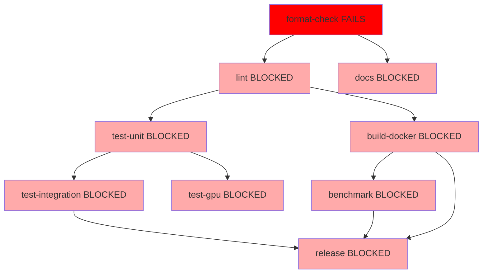
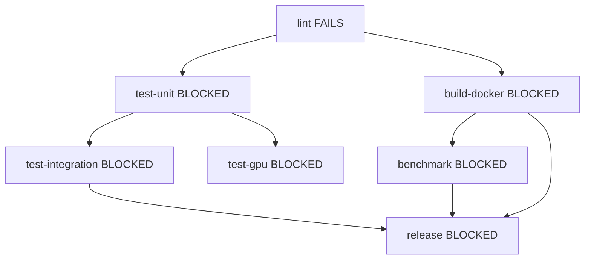
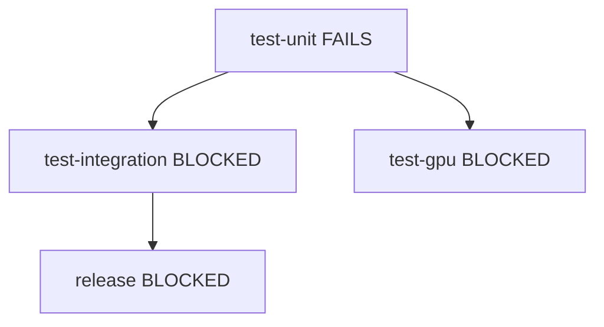
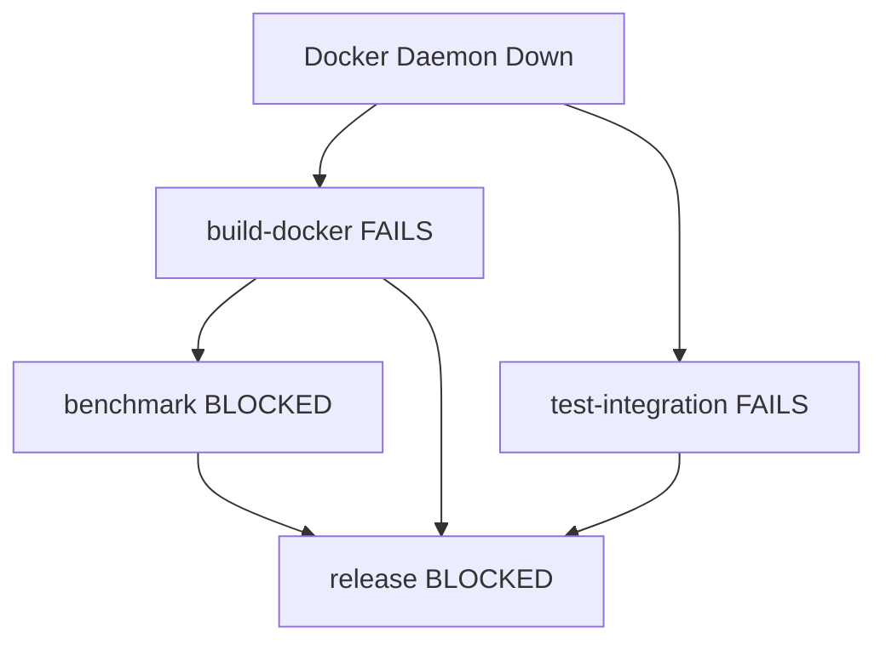
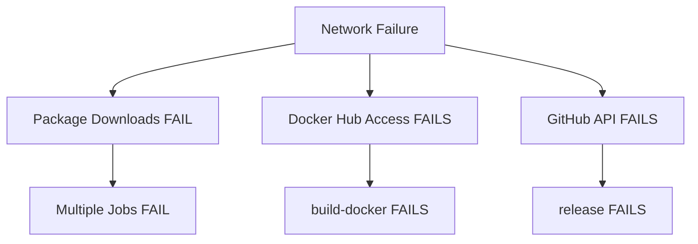
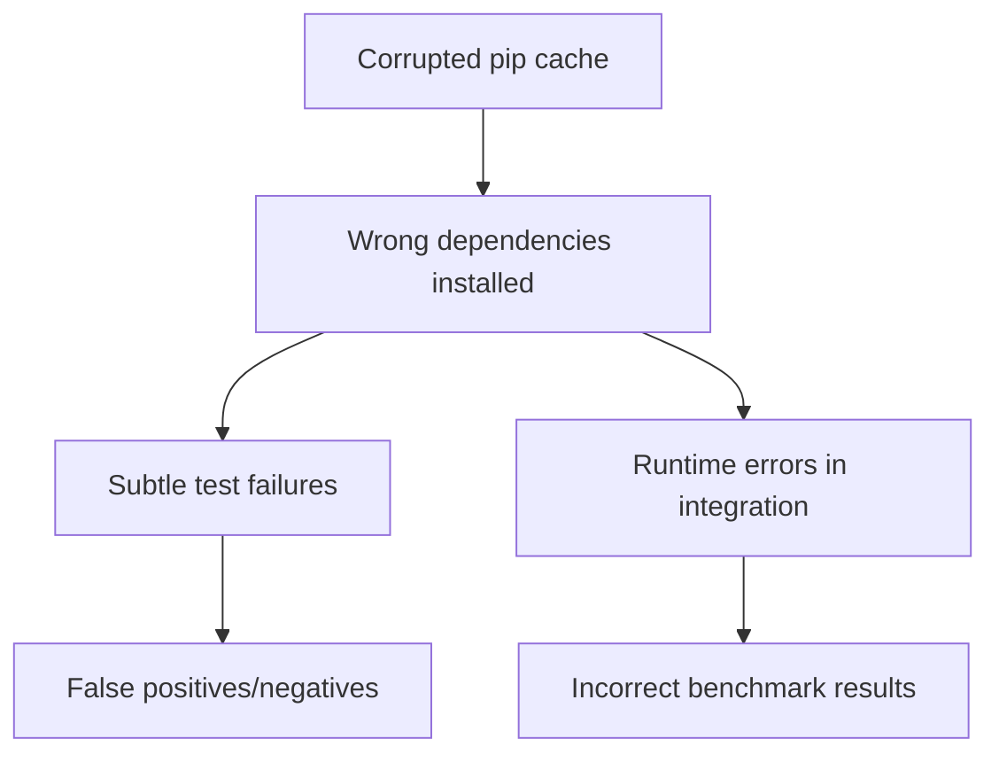
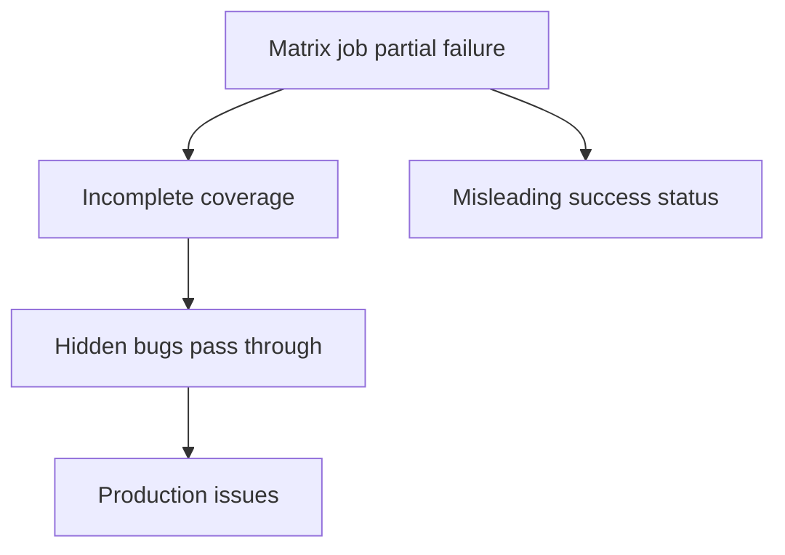
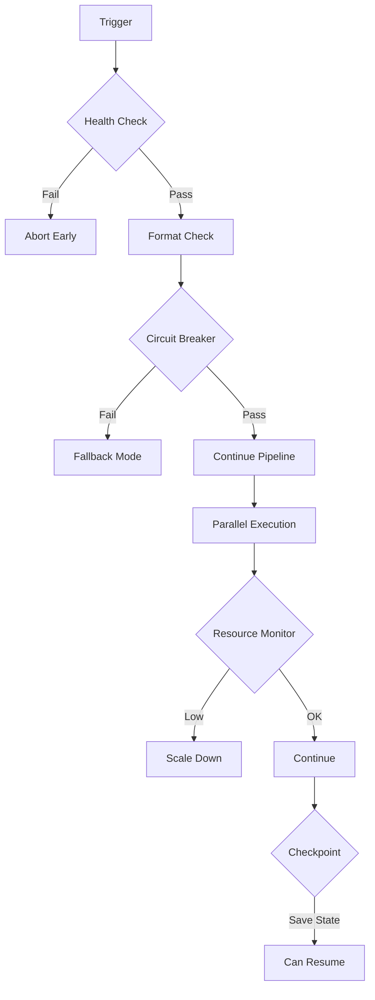

# CI Pipeline Failure Cascade Analysis

## Critical Failure Points and Cascades

### 1. Entry Point Failures (format-check)

**Single Point of Failure**: The `format-check` job is the entry point for the entire pipeline.



**Impact**: 
- **8 jobs blocked** from a single failure
- **100% pipeline failure** from formatter issues
- **No feedback** on actual code quality

**Root Causes**:
1. Network failure downloading formatters (especially StyLua)
2. Misconfigured formatter settings
3. Actual formatting violations
4. Missing configuration files

### 2. Secondary Cascade Points

#### 2.1 Lint Job Failures



**Impact**: 6 downstream jobs blocked

**Cascade Triggers**:
- Security vulnerabilities (bandit/safety)
- Type errors (mypy)
- Code quality issues (pylint)
- Missing dependencies

#### 2.2 Unit Test Failures



**Impact**: 3 critical jobs blocked

**Cascade Triggers**:
- Test failures
- Coverage below 80%
- Timeout (300s)
- Missing test files

### 3. Service Dependency Cascades

#### 3.1 Docker Daemon Failure



**Services Affected**:
- All Docker builds (5 services)
- Integration tests
- Benchmarks
- Release process

#### 3.2 Network Infrastructure Failure



### 4. Resource Exhaustion Cascades

#### 4.1 Disk Space Exhaustion

**Progressive Failure Pattern**:
1. Docker builds start failing (large layers)
2. Log collection fails
3. Artifact uploads fail
4. Cache saves fail
5. Cleanup operations fail

#### 4.2 Memory Exhaustion

**Failure Progression**:
1. Large tests start failing
2. Docker builds OOM
3. Parallel job execution degrades
4. Runner becomes unresponsive

### 5. Time-Based Cascades

#### 5.1 Cumulative Timeout Cascade

```
Total Pipeline Time Budget: ~60 minutes

format-check:     5 min
lint:            10 min (parallel)
test-unit:       15 min (parallel per component)
build-docker:    20 min (parallel per service)
test-integration:15 min
benchmark:       10 min
-----------------------
Minimum Path:    45 min (with perfect parallelism)
```

**Cascade Effect**: 
- Delays accumulate
- GitHub Actions 6-hour job limit
- Self-hosted runner availability

### 6. Hidden Failure Cascades

#### 6.1 Cache Corruption Cascade



#### 6.2 Partial Success Cascade



## Failure Probability Analysis

### High Probability Failures (>10% chance)
1. **Network timeouts** - External dependency downloads
2. **Test flakiness** - Especially integration tests
3. **Docker layer cache misses** - Slow builds
4. **Concurrent resource conflicts** - Parallel job interference

### Medium Probability Failures (1-10% chance)
1. **Runner unavailability** - Especially GPU runners
2. **API rate limits** - GitHub, Docker Hub
3. **Dependency conflicts** - Version mismatches
4. **Timeout cascades** - Accumulated delays

### Low Probability, High Impact Failures (<1% chance)
1. **GitHub Actions outage** - Complete pipeline failure
2. **Supply chain attack** - Compromised dependencies
3. **Data corruption** - Cache/artifact corruption
4. **Certificate expiration** - HTTPS failures

## Mitigation Strategies

### 1. Circuit Breakers
```yaml
- name: Download with Circuit Breaker
  run: |
    MAX_RETRIES=3
    BACKOFF=5
    for i in $(seq 1 $MAX_RETRIES); do
      if wget $URL; then
        break
      fi
      if [ $i -eq $MAX_RETRIES ]; then
        echo "::warning::Download failed, using fallback"
        # Use fallback mechanism
      fi
      sleep $((BACKOFF * i))
    done
```

### 2. Parallel Execution Optimization
```yaml
strategy:
  matrix:
    component: [a, b, c]
  fail-fast: false  # Don't cancel other jobs
  max-parallel: 3   # Limit resource contention
```

### 3. Dependency Isolation
```yaml
- name: Install in Virtual Environment
  run: |
    python -m venv .venv
    source .venv/bin/activate
    pip install --no-cache-dir -r requirements.txt
```

### 4. Health Check Gates
```yaml
- name: Pre-flight Health Check
  run: |
    # Check disk space
    df -h
    # Check memory
    free -m
    # Check Docker
    docker info
    # Check network
    curl -f https://api.github.com
```

### 5. Graceful Degradation
```yaml
- name: Run Tests with Fallback
  run: |
    pytest tests/ || {
      echo "::warning::Full test suite failed, running smoke tests"
      pytest tests/smoke/ -m critical
    }
```

## Testing the Failure Cascades

### Chaos Engineering Tests

1. **Network Partition Test**
   ```bash
   # Simulate network partition
   sudo iptables -A OUTPUT -d github.com -j DROP
   # Run pipeline
   # Observe cascade
   ```

2. **Resource Exhaustion Test**
   ```bash
   # Fill disk
   dd if=/dev/zero of=/tmp/bigfile bs=1M count=$(($(df / | tail -1 | awk '{print $4}') - 1000))
   # Run pipeline
   # Observe cascade
   ```

3. **Service Failure Injection**
   ```bash
   # Kill Docker mid-build
   sleep 30 && sudo systemctl stop docker &
   # Start pipeline
   # Observe cascade
   ```

4. **Time Dilation Test**
   ```bash
   # Slow down system
   stress --cpu 8 --timeout 3600s &
   # Run pipeline
   # Observe timeout cascades
   ```

## Recovery Procedures

### Immediate Recovery
1. **Cancel stuck jobs** - Prevent resource waste
2. **Clear caches** - Resolve corruption
3. **Restart services** - Docker, runners
4. **Re-run from failed job** - Use GitHub's re-run feature

### Post-Failure Analysis
1. **Collect all logs** - Before cleanup
2. **Analyze failure patterns** - Identify cascade trigger
3. **Update timeout values** - Based on actual durations
4. **Add specific error handling** - For identified failure mode

### Prevention Improvements
1. **Add more circuit breakers**
2. **Increase job isolation**
3. **Implement better health checks**
4. **Create failure-specific workflows**

## Cascade Prevention Architecture



This architecture prevents cascades by:
1. Early detection of unsuitable conditions
2. Fallback mechanisms at each stage
3. Resource-aware execution
4. State preservation for recovery