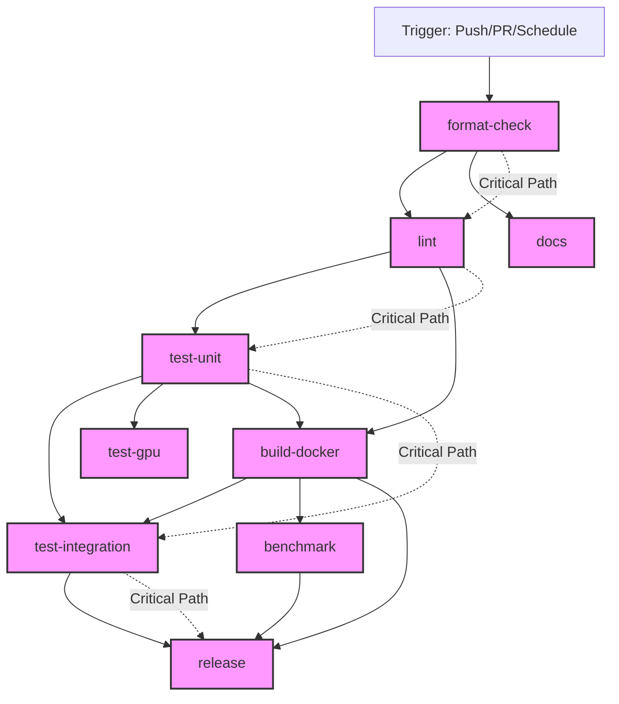

# CI Pipeline Analysis Report

## Executive Summary
The CI pipeline file contains a merge conflict marker at line 1 but appears to be otherwise complete. The pipeline consists of 9 jobs with complex dependencies and multiple potential failure points.

## Pipeline Structure

### Visual Flow Diagram

## Job Analysis

### 1. Format Check (Entry Point)
**Purpose**: Validates code formatting across Python, Lua, C++, and Protocol Buffers
**Dependencies**: None (entry point)
**Failure Points**:
- Python setup failure
- Formatter installation failures (especially StyLua download)
- Network connectivity issues during tool downloads
- Format violations in any language

**Recovery Mechanisms**:
- Retry logic for StyLua download (3 attempts)
- Fallback to skip Lua formatting if download fails
- Graceful degradation with warning messages

### 2. Lint (Second Stage)
**Purpose**: Performs static code analysis across multiple languages
**Dependencies**: Requires format-check to pass
**Failure Points**:
- Dependency cache corruption
- Linter installation failures
- Code quality violations (flake8, mypy, pylint, bandit, safety)
- Security vulnerabilities detected by bandit/safety
- Missing configuration files (.flake8, mypy.ini, .pylintrc, .luacheckrc)

**Recovery Mechanisms**:
- Cache restoration with fallback
- Matrix strategy allows partial failures

### 3. Unit Tests
**Purpose**: Component-level testing with coverage requirements
**Dependencies**: Requires lint to pass
**Failure Points**:
- Pip dependency conflicts
- Test failures
- Coverage below 80% threshold
- Test timeouts (300s limit)
- Missing test directories

**Recovery Mechanisms**:
- Component matrix allows partial success
- Timeout protection prevents hanging
- Coverage upload continues even if tests fail

### 4. Integration Tests
**Purpose**: Full system integration testing
**Dependencies**: Requires unit tests to pass
**Failure Points**:
- Docker daemon unavailable
- Service startup failures
- Network issues between containers
- Health check timeouts (300s)
- Test failures
- Resource exhaustion

**Recovery Mechanisms**:
- Service logs collected on failure
- Graceful cleanup in all cases
- Artifact upload for debugging

### 5. GPU Tests (Special Runner)
**Purpose**: ML/training component testing
**Dependencies**: Requires unit tests, only runs on main branch
**Failure Points**:
- Self-hosted runner unavailable
- CUDA/GPU driver issues
- Python virtual environment creation
- PyTorch installation failures
- GPU memory exhaustion
- Extended timeout issues (1800s)

**Recovery Mechanisms**:
- Conditional execution (main branch only)
- GPU availability verification
- Isolated virtual environment

### 6. Docker Build
**Purpose**: Container image creation and security scanning
**Dependencies**: Requires unit tests and lint
**Failure Points**:
- Docker daemon issues
- Build context problems
- Dockerfile syntax errors
- Base image pull failures
- Security vulnerabilities (Trivy scan)
- Docker Hub authentication
- Network timeouts

**Recovery Mechanisms**:
- BuildKit caching
- Matrix allows partial failures
- Security scanning continues despite vulnerabilities

### 7. Benchmarks
**Purpose**: Performance regression detection
**Dependencies**: Requires Docker build
**Failure Points**:
- Benchmark execution errors
- Performance regression (>150% threshold)
- Result storage failures
- GitHub API issues

**Recovery Mechanisms**:
- Only runs on push events
- Automated result storage

### 8. Documentation
**Purpose**: Documentation generation
**Dependencies**: Only requires format-check
**Failure Points**:
- Sphinx installation issues
- Documentation syntax errors
- Missing documentation files

**Recovery Mechanisms**:
- Runs in parallel with main pipeline
- Artifact upload for review

### 9. Release
**Purpose**: Create GitHub releases
**Dependencies**: Requires Docker, integration tests, and benchmarks
**Failure Points**:
- Tag detection issues
- Changelog generation failures
- GitHub API errors
- Token permission issues

**Recovery Mechanisms**:
- Only runs on version tags
- Prerelease detection for RC/beta

## Failure Cascade Analysis

### Critical Path Failures
The critical path is: format-check → lint → test-unit → test-integration → release

A failure at any point blocks all downstream jobs:
1. **Format failure**: Blocks entire pipeline (8 jobs blocked)
2. **Lint failure**: Blocks 6 jobs
3. **Unit test failure**: Blocks 4 jobs
4. **Integration test failure**: Blocks release

### Parallel Execution Opportunities
- Documentation runs independently after format-check
- GPU tests run in parallel with integration tests
- Docker builds can proceed without integration tests

## Failure Scenarios and Impact

### 1. Tool Installation Failures
**Scenario**: Network issues prevent tool downloads
**Impact**: 
- Format-check: Partial degradation (Lua skipped)
- Lint: Complete job failure
- Tests: Complete failure

**Mitigation**: 
- Add retry logic to all tool installations
- Consider pre-built runner images
- Add fallback mirrors

### 2. Test Failures
**Scenario**: Code changes break tests
**Impact**:
- Immediate: Blocks PR merge
- Downstream: Prevents releases
- Parallel: Wastes GPU runner time

**Mitigation**:
- Run fast tests first
- Implement test result caching
- Add pre-commit hooks

### 3. Docker/Network Issues
**Scenario**: Docker daemon crashes or network fails
**Impact**:
- Integration tests fail completely
- Docker builds fail
- Service logs may be incomplete

**Mitigation**:
- Implement Docker health checks
- Add daemon restart logic
- Use local registry mirrors

### 4. Resource Exhaustion
**Scenario**: Runner runs out of disk/memory
**Impact**:
- Unpredictable failures
- Corrupted artifacts
- Incomplete logs

**Mitigation**:
- Add resource monitoring
- Implement cleanup between jobs
- Set resource limits

## Recommendations

### High Priority
1. **Fix merge conflict** in main-ci.yml
2. **Add global retry logic** for all network operations
3. **Implement circuit breakers** for flaky services
4. **Add pre-flight checks** for runner health

### Medium Priority
1. **Optimize job dependencies** to increase parallelism
2. **Add job-level timeouts** consistently
3. **Implement partial success handling**
4. **Create fallback strategies** for all external dependencies

### Low Priority
1. **Add performance metrics** collection
2. **Implement cost optimization** for runner usage
3. **Create pipeline visualization** dashboard
4. **Add predictive failure analysis**

## Testing Recommendations

To test the failure scenarios:

1. **Network Failure Test**:
   - Use network throttling/blocking
   - Simulate DNS failures
   - Test with proxy misconfigurations

2. **Resource Exhaustion Test**:
   - Fill disk before pipeline run
   - Limit available memory
   - Simulate CPU throttling

3. **Service Failure Test**:
   - Kill Docker daemon mid-build
   - Corrupt cache directories
   - Simulate authentication failures

4. **Chaos Engineering**:
   - Random job failures
   - Intermittent network issues
   - Clock skew simulation