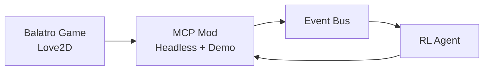
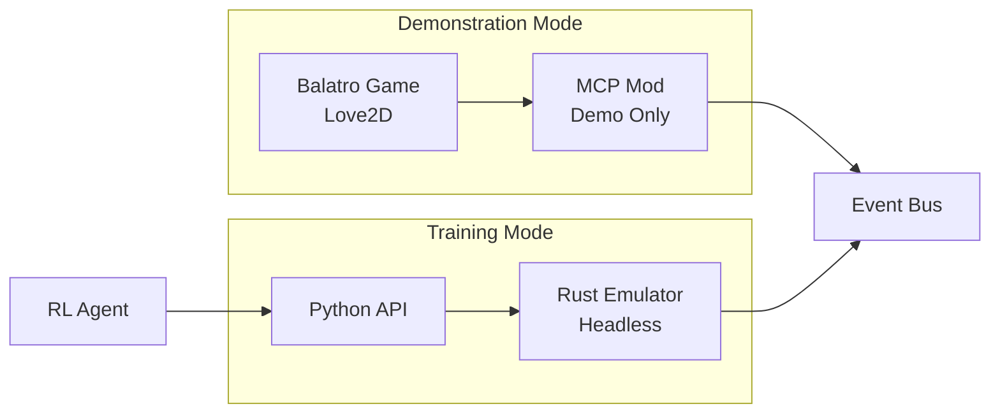
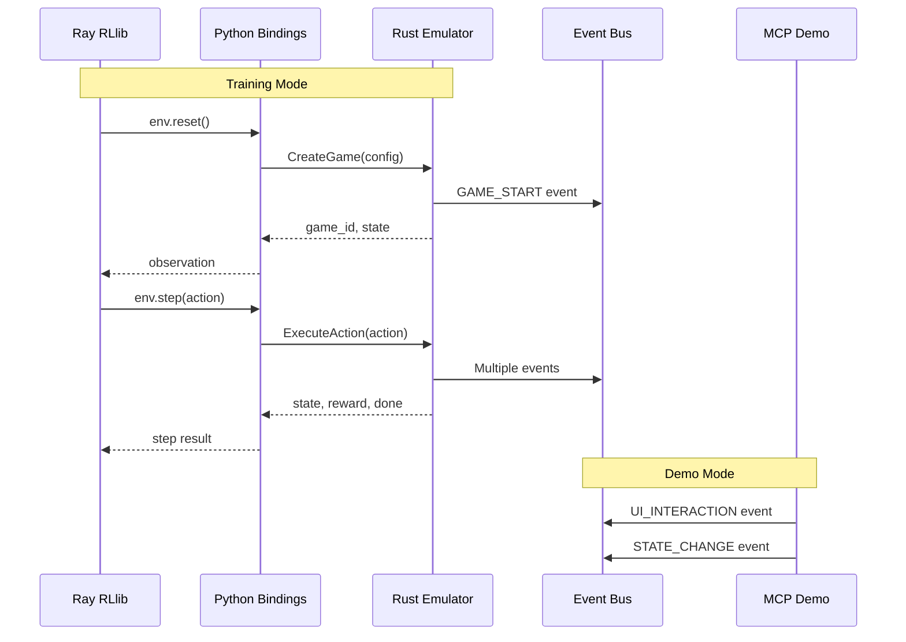

# MCP Mod and Rust Emulator Integration Plan

## Overview

This document details the integration strategy between the existing BalatroMCP mod and the new Rust-based Balatro emulator. The goal is to maintain demonstration capabilities in the MCP mod while delegating headless execution to the high-performance Rust emulator.

## Architectural Transition

### Current Architecture


### New Architecture


## MCP Mod Modifications

### Files to Modify

1. **config.json** - Add emulator mode configuration
```json
{
    "mode": "demo",  // "demo" or "legacy_headless"
    "emulator": {
        "enabled": false,
        "endpoint": "localhost:50051"
    },
    "headless": false,  // Deprecated, kept for compatibility
    "auto_play": false,
    "event_bus_url": "http://localhost:8080/api/v1/events"
}
```

2. **main.lua** - Remove headless initialization
```lua
-- Remove or comment out
-- if config.headless then
--     require("mods.BalatroMCP.headless_override"):init()
-- end

-- Add mode check
if config.mode == "demo" then
    print("BalatroMCP: Running in demonstration mode")
    -- Keep event extraction and UI interaction features
elseif config.mode == "legacy_headless" then
    print("BalatroMCP: WARNING - Legacy headless mode is deprecated")
    print("BalatroMCP: Please use Rust emulator for headless execution")
end
```

3. **headless_override.lua** - Mark as deprecated
```lua
-- Add deprecation warning at top
print("WARNING: headless_override.lua is deprecated")
print("Use Rust emulator for headless game execution")
print("See: balatro_rust_emulator_spec.md for migration")
```

### Features to Retain

1. **Event Extraction** - Continue extracting and sending game state
2. **Action Execution** - Keep ability to execute AI decisions in UI mode
3. **State Monitoring** - Maintain state change detection
4. **Manual Control** - Preserve human interaction features

### Features to Remove

1. **Headless Rendering Override** - No longer needed
2. **Speed Multiplier** - Handled by Rust emulator
3. **Auto-play in Headless** - Rust emulator manages game flow

## Rust Emulator Integration

### Communication Patterns



### Event Compatibility

The Rust emulator will emit events identical to the MCP mod:

| Event Type | MCP Mod (JSON) | Rust Emulator (Protobuf) | Notes |
|------------|----------------|--------------------------|-------|
| GAME_STATE | ✓ | ✓ | Identical payload structure |
| HAND_PLAYED | ✓ | ✓ | Include scoring details |
| JOKER_TRIGGERED | ✓ | ✓ | Preserve trigger order |
| SHOP_ENTERED | ✓ | ✓ | Same item generation |
| MONEY_CHANGED | ✓ | ✓ | Track all transactions |

### Migration Path

#### Phase 1: Parallel Operation (Week 1)
- Deploy Rust emulator alongside existing system
- Run comparison tests between MCP headless and Rust emulator
- Validate event compatibility

#### Phase 2: Integration Testing (Week 2)
- Update Ray RLlib environment to use Rust emulator
- Keep MCP mod as fallback option
- Monitor performance metrics

#### Phase 3: Full Migration (Week 3)
- Switch all training to Rust emulator
- Update MCP mod to demo-only mode
- Document new workflows

## Configuration Management

### Environment Variables
```bash
# For RL Training
BALATRO_EMULATOR_MODE=rust
BALATRO_EMULATOR_ENDPOINT=localhost:50051
BALATRO_EMULATOR_THREADS=4

# For Demonstrations
BALATRO_EMULATOR_MODE=mcp_demo
BALATRO_MCP_CONFIG=/path/to/demo_config.json
```

### Python Environment Configuration
```python
# jimbot/training/env_config.py
EMULATOR_CONFIG = {
    "mode": os.getenv("BALATRO_EMULATOR_MODE", "rust"),
    "rust_config": {
        "endpoint": os.getenv("BALATRO_EMULATOR_ENDPOINT", "localhost:50051"),
        "max_concurrent_games": 100,
        "event_batch_size": 1000,
    },
    "mcp_config": {
        "config_path": os.getenv("BALATRO_MCP_CONFIG", "config/demo.json"),
    }
}
```

## Testing Strategy

### Compatibility Tests
1. **Event Format Validation**
   - Compare JSON from MCP with Protobuf from Rust
   - Ensure all fields map correctly

2. **Game Logic Verification**
   - Run identical scenarios in both systems
   - Compare final scores and game outcomes

3. **Performance Benchmarks**
   - Measure speedup factor
   - Monitor resource usage

### Test Suite Structure
```
tests/
├── compatibility/
│   ├── test_event_format.py
│   ├── test_game_outcomes.py
│   └── test_scoring_parity.py
├── integration/
│   ├── test_ray_rust_integration.py
│   ├── test_mcp_demo_mode.py
│   └── test_event_bus_flow.py
└── performance/
    ├── benchmark_throughput.py
    └── benchmark_latency.py
```

## Rollback Plan

If issues arise with the Rust emulator:

1. **Immediate Rollback**
   - Set `BALATRO_EMULATOR_MODE=mcp_legacy`
   - Restart training with MCP headless mode

2. **Debugging Mode**
   - Run both systems in parallel
   - Compare outputs for divergence
   - Log detailed execution traces

3. **Gradual Migration**
   - Use Rust for new experiments
   - Keep critical runs on MCP temporarily

## Documentation Updates

### Files to Update
1. `README.md` - Add Rust emulator setup instructions
2. `docs/architecture.md` - Update system architecture
3. `mods/BalatroMCP/README.md` - Note deprecation of headless mode
4. `jimbot/training/README.md` - New environment configuration

### New Documentation
1. `docs/rust_emulator_guide.md` - Usage and API reference
2. `docs/migration_guide.md` - Step-by-step migration
3. `docs/troubleshooting.md` - Common issues and solutions

## Success Criteria

1. **Functional Success**
   - All RL training works with Rust emulator
   - Demo mode operates without issues
   - Event compatibility maintained

2. **Performance Success**
   - >10x speedup for training
   - <100MB memory per game
   - >10,000 games/hour throughput

3. **Integration Success**
   - Seamless Ray RLlib integration
   - Clean Python API
   - Minimal code changes required

## Timeline

- **Week 1**: Implement integration points, compatibility tests
- **Week 2**: Parallel testing, performance validation
- **Week 3**: Full migration, documentation updates
- **Week 4**: Production deployment, monitoring

This integration plan ensures a smooth transition from the MCP mod's headless mode to the high-performance Rust emulator while maintaining all demonstration capabilities and compatibility with the existing JimBot infrastructure.