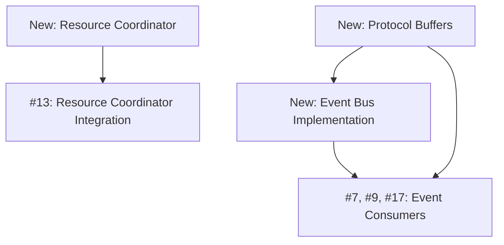

# GitHub Issues Reconciliation - Rust Migration

## Overview

This document reconciles the existing 51 GitHub issues (created before the Rust
migration decision) with our new Rust-focused architecture plan.

## Summary of Findings

### Existing Issues Status

- **Total Open Issues**: 51
- **Epics**: 3 (#1 Knowledge Graph, #2 Claude Integration, #8 Analytics)
- **Missing Core Components**: Event Bus implementation, Resource Coordinator
  implementation
- **Language Updates Needed**: Analytics (to Rust), MAGE modules (to Rust)

### Key Gaps Identified

1. **No Event Bus Implementation Issue**
   - Multiple consumer issues exist (#7, #9, #17)
   - No issue for implementing the Event Bus itself
   - Critical for BalatroMCP integration

2. **No Resource Coordinator Implementation Issue**
   - Integration issue exists (#13)
   - No issue for implementing the coordinator itself

3. **No Rust Language Specifications**
   - All issues predate the Rust migration decision
   - Implementation language not specified in most issues

## Reconciliation Plan

### 1. New Issues to Create

#### Critical Infrastructure (P0)

**Issue: Implement Rust Event Bus with REST API Compatibility**

- Milestone: Week 0-1
- Labels: `infrastructure`, `rust`, `critical`, `new`
- Description: Production Event Bus replacing Python test server
- Key Requirements:
  - REST API for BalatroMCP compatibility
  - Protocol Buffer conversion
  - gRPC for other components
  - Docker deployment

**Issue: Implement Resource Coordinator in Rust**

- Milestone: Week 1-2
- Labels: `infrastructure`, `rust`, `critical`, `new`
- Description: Central resource management service
- Key Requirements:
  - GPU time slicing
  - Memory allocation tracking
  - API quota management
  - Prometheus metrics

**Issue: Protocol Buffer Schema Definitions**

- Milestone: Week 0
- Labels: `infrastructure`, `protobuf`, `critical`, `new`
- Description: Define all event schemas in Protocol Buffers
- Key Requirements:
  - Maintain JSON compatibility
  - Version management
  - Code generation setup

### 2. Issues Requiring Updates

#### Analytics Epic (#8) and Children

**Updates Needed**:

- Specify Rust as implementation language
- Add Protocol Buffer support details
- Update performance targets for Rust

**Affected Issues**:

- #17: Event Bus Consumer for Analytics → Specify Rust implementation
- #22: QuestDB Analytics Tables → Add Rust client details
- #24: EventStore Streams → Add Rust integration
- #34: Optimize Ingestion → Update targets for Rust performance

#### MAGE Algorithms (#31)

**Updates Needed**:

- Change from Python to Rust implementation
- Update code examples to Rust
- Add Rust-specific performance targets

**New Description Section**:

```rust
// Example Rust MAGE module
use memgraph_rust::*;

#[query_module]
mod balatro_algorithms {
    #[read_procedure]
    fn detect_joker_synergies(
        ctx: &Context,
        min_occurrences: i64,
        min_win_rate: f64,
    ) -> Result<RecordStream> {
        // Rust implementation
    }
}
```

### 3. Issues That Remain Valid

#### Knowledge Graph Epic (#1) and Most Children

- Core Memgraph functionality unchanged
- GraphQL interface still appropriate
- Only MAGE modules affected by Rust migration

#### Claude/LangChain Epic (#2) and All Children

- Remains Python implementation
- No changes needed
- Integration patterns still valid

#### General Features

- Most feature issues remain valid
- Implementation details may change
- Interfaces remain consistent

### 4. Issue Dependencies Update



## Recommended Actions

### Immediate Actions (Week 0)

1. **Create New Infrastructure Issues**

   ```bash
   gh issue create --title "[Infrastructure]: Implement Rust Event Bus with REST API" \
     --body "See planning/github_issues_reconciliation.md" \
     --label "infrastructure,rust,critical"
   ```

2. **Update Analytics Issues**
   - Add Rust implementation notes
   - Update performance targets
   - Add Protocol Buffer details

3. **Update MAGE Issue #31**
   - Change to Rust implementation
   - Update code examples
   - Revise performance targets

### Sprint 1 Updates

1. **Link New Issues**
   - Connect Event Bus to consumers
   - Connect Resource Coordinator to integration
   - Update epic descriptions

2. **Create Rust Development Guide**
   - Setup instructions
   - Development workflow
   - CI/CD pipeline

### Communication Plan

1. **Issue Comments**
   - Add comment to each affected issue
   - Link to this reconciliation document
   - Explain Rust migration rationale

2. **Epic Updates**
   - Update epic descriptions
   - Add Rust migration notes
   - Revise timelines if needed

## Issue Mapping Table

| Original Issue                  | Status     | Action Required                 | Priority |
| ------------------------------- | ---------- | ------------------------------- | -------- |
| Event Bus (missing)             | Create New | Create implementation issue     | P0       |
| Resource Coordinator (missing)  | Create New | Create implementation issue     | P0       |
| #8: Analytics Epic              | Update     | Add Rust specification          | P0       |
| #31: MAGE Algorithms            | Update     | Change to Rust                  | P1       |
| #17: Analytics Consumer         | Update     | Specify Rust                    | P1       |
| #13: Resource Coord Integration | Valid      | Update after coordinator exists | P1       |
| #1: Knowledge Graph Epic        | Valid      | No changes                      | -        |
| #2: Claude Epic                 | Valid      | No changes                      | -        |

## Benefits of Reconciliation

1. **Alignment**: Issues match architectural decisions
2. **Clarity**: Implementation language specified
3. **Dependencies**: Clear relationships between components
4. **Performance**: Rust benefits documented

## Next Steps

1. Review this reconciliation with team
2. Create new infrastructure issues
3. Update affected existing issues
4. Begin Sprint 1 with aligned issues

## Appendix: Issue Templates

### Event Bus Implementation Issue

```markdown
## Description

Implement production-ready Event Bus in Rust to replace Python test server and
serve as central message router for all JimBot components.

## Context

- BalatroMCP mod already implemented and sending REST API events
- Must maintain backward compatibility with existing REST endpoints
- Will serve as foundation for all component communication

## Acceptance Criteria

- [ ] REST API endpoints compatible with BalatroMCP
  - [ ] POST /api/v1/events (single event)
  - [ ] POST /api/v1/events/batch (batch events)
- [ ] JSON to Protocol Buffer conversion
- [ ] gRPC service for other components
- [ ] Topic-based routing
- [ ] Docker deployment ready
- [ ] Health check endpoints

## Technical Requirements

- Language: Rust
- Frameworks: Axum (REST), Tonic (gRPC)
- Performance: 10,000+ events/second
- Deployment: Docker container

## Dependencies

- Blocks: All Event Bus consumer issues (#7, #9, #17)
- Related: Protocol Buffer schemas (new issue)
```

### Resource Coordinator Implementation Issue

```markdown
## Description

Implement Resource Coordinator service in Rust for managing GPU, memory, and API
quotas across all JimBot components.

## Acceptance Criteria

- [ ] gRPC service interface
- [ ] GPU time slice management
- [ ] Memory allocation tracking
- [ ] Claude API rate limiting
- [ ] Request prioritization
- [ ] Prometheus metrics export
- [ ] Docker deployment

## Technical Requirements

- Language: Rust
- Framework: Tonic (gRPC)
- Performance: <1ms response time
- Monitoring: Prometheus metrics

## Dependencies

- Blocks: #13 (Resource Coordinator Integration)
- Related: All components requiring resources
```
