# MCP Communication Framework - Dependency Graph Visualization

## Optimized Dependency Structure

```mermaid
graph TD
    Epic[Epic: MCP Communication Framework]

    %% Immediate start issues
    Bug1[#1: Fix BalatroMCP aggregation<br/>START IMMEDIATELY]
    Bug2[#2: Fix BalatroMCP retry logic<br/>START IMMEDIATELY]
    Schema[#3: Protocol Buffer schemas<br/>START IMMEDIATELY]
    Docker[#4: Docker environment<br/>START IMMEDIATELY]

    %% First wave
    EventBus[#5: Event Bus infrastructure<br/>Blocked by: #4]
    ProtoBuild[#6: Protobuf compilation<br/>Blocked by: #3]

    %% Core
    MCPServer[#7: MCP Server core<br/>Blocked by: #5, #6]

    %% Features
    Adapter[#8: BalatroMCP adapter<br/>Blocked by: #1, #2, #7]
    Aggregation[#9: Complex aggregation<br/>Blocked by: #7]
    ResourceCoord[#11: Resource Coordinator<br/>Blocked by: #3, #7]

    %% Advanced
    Performance[#10: Performance optimization<br/>Blocked by: #9]

    %% Final phase
    Testing[#12: Test suite<br/>Blocked by: #8]
    Production[#13: Production hardening<br/>Blocked by: #10, #11, #12]
    Documentation[#14: Documentation<br/>Blocked by: #13]

    %% Dependencies
    Epic --> Bug1
    Epic --> Bug2
    Epic --> Schema
    Epic --> Docker

    Docker --> EventBus
    Schema --> ProtoBuild
    Schema --> ResourceCoord

    EventBus --> MCPServer
    ProtoBuild --> MCPServer

    Bug1 --> Adapter
    Bug2 --> Adapter
    MCPServer --> Adapter
    MCPServer --> Aggregation
    MCPServer --> ResourceCoord

    Aggregation --> Performance

    Adapter --> Testing
    Performance --> Production
    ResourceCoord --> Production
    Testing --> Production

    Production --> Documentation

    %% Styling
    classDef immediate fill:#90EE90,stroke:#006400,stroke-width:3px
    classDef blocked fill:#FFB6C1,stroke:#8B0000,stroke-width:2px
    classDef core fill:#87CEEB,stroke:#00008B,stroke-width:2px
    classDef final fill:#DDA0DD,stroke:#4B0082,stroke-width:2px

    class Bug1,Bug2,Schema,Docker immediate
    class EventBus,ProtoBuild,Adapter,Aggregation,ResourceCoord,Performance,Testing blocked
    class MCPServer core
    class Production,Documentation final
```



## Parallel Work Streams

### Stream 1: Bug Fixes (2 developers)

```
Day 1-3: #1 Fix aggregation bugs
Day 1-3: #2 Fix retry logic
Day 4-5: #8 BalatroMCP adapter (after #7 available)
```

### Stream 2: Infrastructure (1 developer)

```
Day 1-2: #4 Docker environment
Day 3-4: #5 Event Bus setup
Day 5+: Support #7 MCP Server
```

### Stream 3: Schemas & Build (1 developer)

```
Day 1-2: #3 Protocol Buffer schemas
Day 3-4: #6 Compilation pipeline
Day 5+: Support #7 MCP Server
```

### Stream 4: Core Implementation (2 developers)

```
Day 4-5: #7 MCP Server (when #5, #6 ready)
Week 2: #9 Complex aggregation
Week 2: #11 Resource Coordinator
Week 2-3: #10 Performance optimization
```

### Stream 5: Quality & Production (1-2 developers)

```
Week 2: #12 Test suite (when #8 ready)
Week 3: #13 Production hardening
Week 3: #14 Documentation
```

## Key Optimizations vs Sprint Plan

1. **Parallel Start**: 4 issues can begin immediately vs sequential sprint
   approach
2. **Bug Fixes First**: Address existing bugs before building new features
3. **Early Integration**: Resource Coordinator can start as soon as schemas are
   ready
4. **Continuous Testing**: Test suite development overlaps with feature
   development
5. **No Artificial Delays**: Removed sprint boundaries that would delay
   dependent work

## Critical Path

The shortest path to a working system:

```
#4 Docker (2 days) →
#5 Event Bus (2 days) + #3 Schemas (2 days) → #6 Protobuf (2 days) →
#7 MCP Server (2 days) →
#8 Adapter (2 days) →
Basic working system in ~8-10 days with parallel execution
```

## Resource Allocation

- **Week 1**: 5-7 developers can work in parallel
- **Week 2**: 3-4 developers on features/testing
- **Week 3**: 2-3 developers on hardening/docs

This structure reduces the total timeline from 4 weeks to potentially 2.5-3
weeks with proper parallelization.
